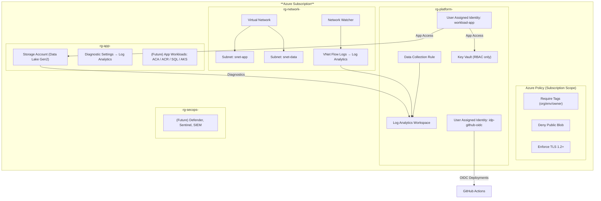

# Architecture Overview

This document provides a high-level architecture view of the **Azure Enterprise Architecture Starter Kit**, which is a subscription-scope Bicep deployment that creates a secure, modular landing zone for applications and data workloads.

---

## Design Goals

| Goal                              | How It’s Achieved                                          |
| --------------------------------- | ---------------------------------------------------------- |
| Rapid onboarding                  | One `az deployment sub create` command                     |
| Security baseline                 | TLS 1.2+, no public blob access, RBAC, tagging policies    |
| Enterprise separation of concerns | Dedicated RGs for platform, networking, apps, and security |
| Operational visibility            | Log Analytics + DCR + diagnostic settings wired in         |
| Identity-first automation         | Managed identities for CI/CD and workloads                 |
| Extensibility                     | Modules can be added without rewriting the foundation      |

---

## Architecture Diagram



## Logical Architecture

┌───────────────────────────── Subscription ──────────────────────────────┐
│ │
│ Policies & Governance (subscription-scope) │
│ - Tag enforcement │
│ - TLS enforcement │
│ - Deny public blob │
│ - baselines for new resources │
│ │
│ Resource Groups │
│ ┌───────────────────────────────┬───────────────────────────────────┐ │
│ │ rg-platform │ rg-network │ │
│ │ - Log Analytics (workspace) │ - Virtual Network (hub-lite) │ │
│ │ - Data Collection Rule │ - Subnets (app / data) │ │
│ │ - Key Vault (RBAC) │ - VNet flow logs │ │
│ │ - Managed identities │ - NSG │ │
│ ├───────────────────────────────┴───────────────────────────────────┤ │
│ │ rg-app │ │
│ │ - Storage (Data Lake Gen2) │ │
│ │ - Application workloads later (Acr, ACA, AKS, SQL, etc.) │ │
│ ├───────────────────────────────────────────────────────────────────┤ │
│ │ rg-secops │ │
│ │ - Defender for Cloud (future) │ │
│ │ - Sentinel / SIEM integrations (future) │ │
│ └───────────────────────────────────────────────────────────────────┘ │
│ │
└─────────────────────────────────────────────────────────────────────────┘

---

## Resource Groups (separation of concerns)

| Resource Group        | Purpose                                                       |
| --------------------- | ------------------------------------------------------------- |
| **rg-platform-<env>** | Shared services: Log Analytics, Key Vault, managed identities |
| **rg-network-<env>**  | VNet, subnets, flow logs, NSGs                                |
| **rg-app-<env>**      | Storage, & application workloads (web, API, data pipelines)   |
| **rg-secops-<env>**   | Future: Sentinel, threat intelligence, SOC tooling            |

This separation mirrors Microsoft Landing Zone and enterprise reference architectures. This structure is easy to secure, audit, and delegate RBAC boundaries.

---

## Security & Governance Baseline

### \*Azure Policy initiative applied at subscription:

- Required tags (`org`, `env`, `owner`)
- Deny Public Blob Access
- Minimum TLS ≥ 1.2
- Optional: blocked RDP/SSH inbound

### Key Vault

- RBAC-only access
- Soft delete + purge protection
- Private endpoints recommended later

### Storage

- Hierarchical namespace (Data Lake Gen2)
- No shared key access (optional)
- TLS >= 1.2
- Audit + diagnostics to Log Analytics

---

## Observability Baseline

- Log Analytics workspace
- Data Collection Rule (DCR)
- Diagnostic settings wired to Storage, VNet, etc.

This means that logs and metrics are collected on Day 1, and not forgotten until an incident.

---

## Identity & Automation

Two common identities are created:

| Identity          | Purpose                                               |
| ----------------- | ----------------------------------------------------- |
| `idp-github-oidc` | GitHub Actions → Azure deployments (OIDC, no secrets) |
| `workload-app`    | Running apps or pipelines accessing storage / KV      |

No passwords required, no long-lived SP secrets, and identity federation only.

---

## Extensibility Model

New components can be added just by creating modules:

- `containerapps.bicep` → ACA environment + workloads
- `acr.bicep` → private registry with RBAC
- `sql.bicep` or `cosmos.bicep` → private endpoints + diagnostics
- `eventhub.bicep` or `servicebus.bicep` → messaging
- `sentinel.bicep` → SIEM baseline

Because everything is modular, `main.bicep` doesn’t become a giant monolith.

---

## Deployment Flow

```bash
az deployment sub create
--location japaneast
--template-file main.bicep
--parameters @environments/dev/sub.parameters.json

```

- Subscription-scope deployment creates RGs and identities
- Each RG invokes modules inside itself
- Outputs provided for chaining into CI/CD pipelines

---

## Cleanup

```bash
az group delete -n rg-platform-dev -y
az group delete -n rg-network-dev -y
az group delete -n rg-app-dev -y
az group delete -n rg-secops-dev -y

```

## Why this pattern works

- Matches Azure Landing Zone best practices
- Least-privilege by default
- No public endpoints unless intentionally added
- Modular and production-ready
- Works for dev → prod pipelines
