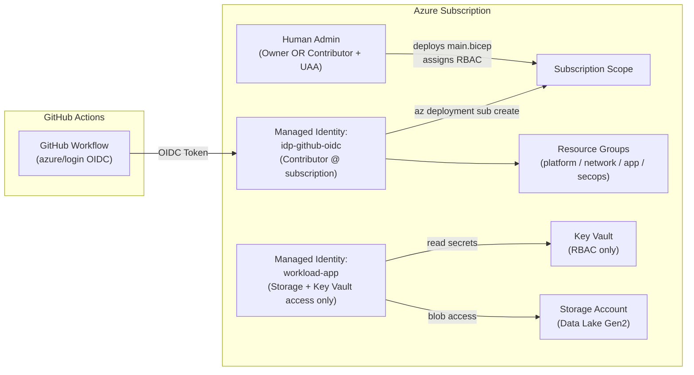

# Required Permissions for Deployment

This document explains the minimum RBAC permissions needed to deploy and operate the Azure Enterprise Architecture Starter Kit.

## Overview

This starter kit deploys infrastructure at subscription scope, creates managed identities, and assigns RBAC roles to workloads.



To support this securely and without secrets, the following Azure identities are required:

| Identity                                   | Purpose                                                  |
| ------------------------------------------ | -------------------------------------------------------- |
| You (admin/operator)                       | Runs Bicep deployment and assigns roles                  |
| `idp-github-oidc` (User Assigned Identity) | Allows GitHub Actions to deploy infra using OIDC         |
| `workload-app` (User Assigned Identity)\*  | Grants applications secure access to Storage & Key Vault |

To deploy the landing zone, you must have one of:

Owner (full control)
OR
Contributor + User Access Administrator

| Permission                | Required For                                        |
| ------------------------- | --------------------------------------------------- |
| Contributor               | Run `az deployment sub create` and create resources |
| User Access Administrator | Assign RBAC to managed identities                   |

This is the minimal set. No need to grant full Owner if your organization prefers strict privilege isolation.

## GitHub OIDC Identity

The GitHub deployment workflow uses `azure/login@v2` and federated identity credentials — no secrets required.

The identity `idp-github-oidc` needs:

| Role        | Scope                     | Why                                                                   |
| ----------- | ------------------------- | --------------------------------------------------------------------- |
| Contributor | `/subscriptions/<SUB_ID>` | Allows GitHub Actions to deploy Bicep templates at subscription level |

Assign via CLI:

```bash
az role assignment create \
 --subscription <SUB_ID> \
 --assignee-object-id <GITHUB_SP_OBJECT_ID> \
 --assignee-principal-type ServicePrincipal \
 --role Contributor \
 --scope "/subscriptions/<SUB_ID>"
```

- Deploys resource groups
- Creates identities, VNET, storage, diagnostics, policy
- Future-proof. Same identity can deploy ACA, SQL, AKS, etc.

## Workload Managed Identity

`workload-app` is used by applications running in Azure (e.g., ACA, VMs, AKS pods, pipelines).
It is least-privilege and DOES NOT get subscription access.

Grant only resource-level roles:

### Storage (Data Lake Gen2 / Blob)

```bash
az role assignment create \
 --assignee-object-id <WORKLOAD_ID> \
 --role "Storage Blob Data Contributor" \
 --scope <STORAGE_ACCOUNT_RESOURCE_ID>
```

### Key Vault

```bash
az role assignment create \
 --assignee-object-id <WORKLOAD_ID> \
 --role "Key Vault Secrets User" \
 --scope <KEYVAULT_RESOURCE_ID>
```

## Security Benefits

| Benefit                    | Explanation                                                |
| -------------------------- | ---------------------------------------------------------- |
| No secrets                 | OIDC means no passwords or client secrets in GitHub        |
| Least privilege            | Workload identity only sees storage + KV, nothing else     |
| GitHub cannot read secrets | Only Contributor at subscription, no Key Vault permissions |
| Cloud-native               | Matches Microsoft Landing Zone & Zero Trust layouts        |

## Summary Table

| Identity          | Permission                                           | Scope           | Purpose                    |
| ----------------- | ---------------------------------------------------- | --------------- | -------------------------- |
| Human admin       | Owner **OR** Contributor + User Access Administrator | Subscription    | Deploy Bicep, assign roles |
| `idp-github-oidc` | Contributor                                          | Subscription    | Deploy via GitHub Actions  |
| `workload-app`    | Storage Blob Data Contributor                        | Storage account | Read/write blobs, ADLS     |
| `workload-app`    | Key Vault Secrets User                               | Key Vault       | Access secrets for apps    |
